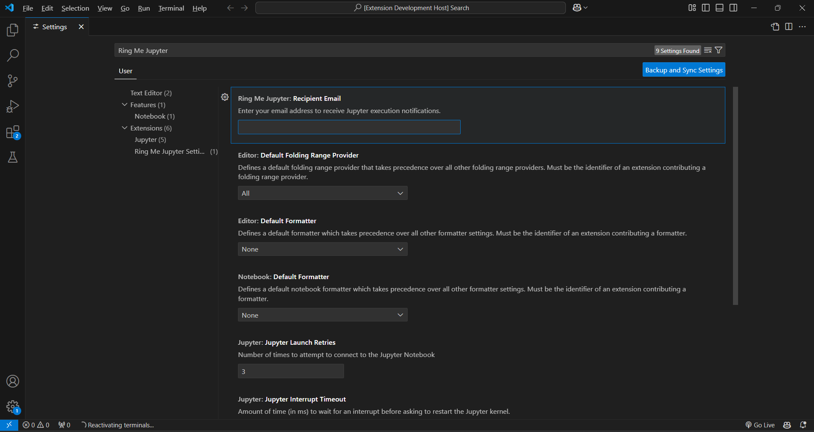

# 🔔 Ring Me Jupyter

🔔 **Get notified when your Jupyter Notebook cells finish executing!**

Ring Me Jupyter is a **VS Code extension** that sends **email notifications** when your Jupyter Notebook cells complete execution. Stay informed and boost productivity by receiving alerts directly in your inbox. This is especially useful for **long-running data science tasks** like **training neural networks, running large-scale simulations, or processing big datasets**, allowing you to focus on other work while waiting for results.

---

## ⚙️ Setup
### **1️⃣ Configure Your Email in VS Code Settings**
1. Open **Settings**:
   - **Windows & Linux:** (`Ctrl + ,`)
   - **Mac:** (`Cmd + ,`)
2. Search for `Ring Me Jupyter: Recipient Email`
3. Enter your email address (e.g., `your-email@example.com`)
4. Save settings ✅

### **2️⃣ Enable Notifications on a Cell**
- Click on the **🔕/🔔 bell icon** next to a Jupyter cell to toggle email notifications.

---

## 🔥 Features
- ✅ **Real-time Email Alerts** - Receive an email from **alert@ringmejupyter.com** containing the cell’s output once execution is complete.
- ✅ **Custom Email Configuration** - Set your recipient email inside VS Code settings.
- ✅ **Simple Toggle Button** - Enable or disable notifications per cell.
- ✅ **Works Seamlessly with Jupyter Notebooks** - No extra setup required.

---

## 💙 Support Development
🔧 I would love to **improve Ring Me Jupyter** by adding **SMS notifications**, so users can receive alerts over text messages. Developing and maintaining this feature requires additional resources, and **your support helps make it possible**! If you find this extension useful, consider supporting me on Ko-fi:  
[☕ Support on Ko-fi](https://ko-fi.com/ringmejupyter)

Every contribution helps bring **SMS alerts** to life and keeps the project growing. Thank you! 🙌

---

## 📄 License
Apache 2.0 License © 2025 Ring Me Jupyter

---

## 📌 Version
**Current Version:** 1.0.0

---

**Enjoy!**
